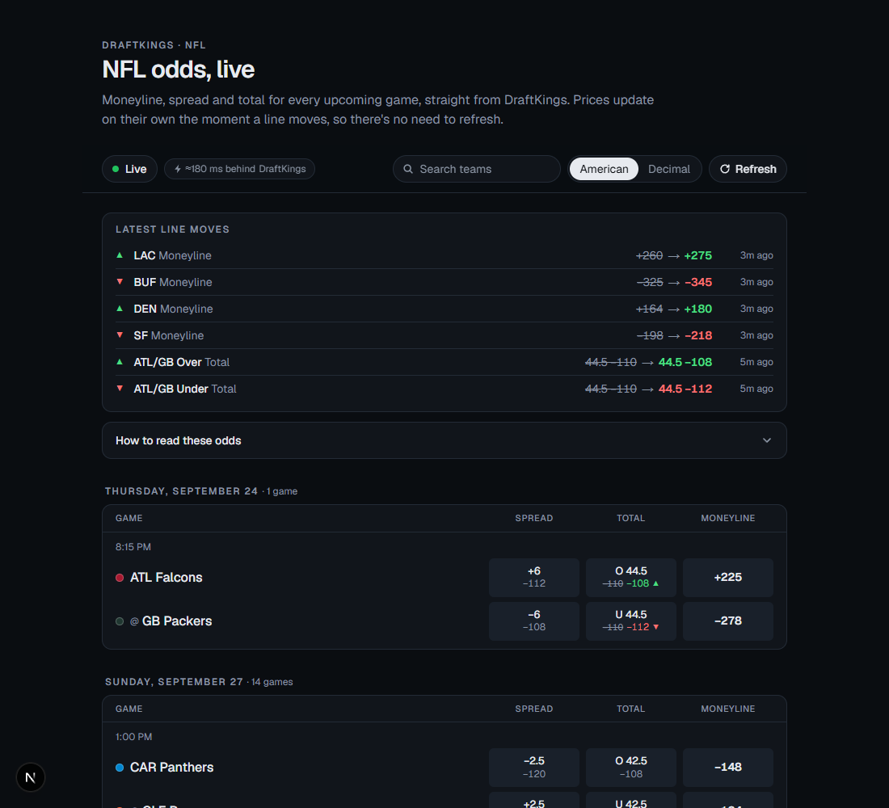
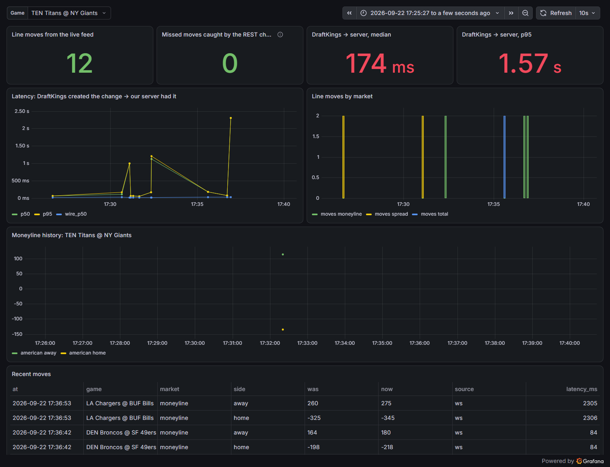

# DraftKings NFL Live Odds

Live NFL moneyline, spread and total odds from DraftKings, on a page that updates itself as lines move.

- **Live:** https://draftkings-live-odds.vercel.app
- **Freshness:** on the live site, a line move reaches your screen **about 0.25 s after DraftKings creates it** (median). Occasionally DraftKings itself holds a change for 1–2 s before publishing it, which is the long tail. [Details](#how-fresh-are-the-odds).
- **Nothing missed:** in a 20-minute audit, the push feed delivered all 26 NFL price changes DraftKings made (0 missed). [How that was checked](#does-the-live-feed-miss-anything).



## Quick start

Requires Node 20+ and git.

```bash
git clone https://github.com/Twoos123/draftkings-live-odds.git
cd draftkings-live-odds
npm install
npm run dev
```

Then open http://localhost:3000. No accounts, keys or configuration are needed. More in [Running locally](#running-locally) and [Deploying](#deploying).

## How it works

```
                 DraftKings                           Vercel · Next.js (Node)                  Your browser
                 ──────────                           ───────────────────────                  ────────────
 WebSocket push feed (changes only) ── deltas ──►  OddsHub, one per instance      ── SSE ──►  BoardEngine
   wss://sportsbook-ws-us-nj…/websocket              relays every update as-is,               (same code as the server)
                                                     measures latency, health                  applies deltas,
                                                                                               diffs → moves, prev prices
 REST board (full snapshot) ◄───────────────────── loaded by the browser directly ───────────  on load, every 60 s, Refresh
   sportsbook-nash…/leagueSubcategory/v1/markets     (DK allows cross-origin reads;
                                                      it blocks cloud IPs, not browsers)
```

1. **The server holds DraftKings' push feed.** It opens the same WebSocket sportsbook.draftkings.com uses, subscribes to NFL "Game Lines" (moneyline, spread, total), and relays every update to every browser over Server-Sent Events. Each update is encoded once, and the same bytes go to all viewers.
2. **The browser loads the full board straight from DraftKings.** It uses DraftKings' REST endpoint, which sends `Access-Control-Allow-Origin: *`, so any web page may read it. That's the same split DraftKings' own site uses: board over REST, changes over the socket. [Why it's split this way](#what-we-hit-and-how-we-got-around-it).
3. **Deltas become a live board.** The browser runs `BoardEngine`, the same tested code the server uses:
   - It applies each delta to its copy of DraftKings' entities.
   - It rebuilds only the game that changed, diffs it, and records the move and previous price.
   - Updates that arrived while the board was loading are replayed on top. On connect, the server replays the last 10 s of updates as well.
4. **Keep it honest.** Every 60 s the browser re-checks the full board with DraftKings. Any price that differs from what the deltas produced is corrected and counted as a "resync correction", shown under **Feed details**. If the delta handling is right, that stays at 0.
5. **What you see:**
   - Moved prices flash green or red, with the old price crossed out beside the new one for 10 minutes.
   - A **Latest line moves** panel lists recent changes; click one to jump to the game.
   - A sticky toolbar holds the live status, a "≈0.2 s behind DraftKings" latency badge, team search, American/decimal odds, and **Refresh**, which re-checks every line now.
   - **How to read these odds** explains spreads, totals and moneylines.
   - Hovering a price shows its implied win probability.
   - When the data can't be trusted, the page says so.

### Why this approach

The brief says the *how* is the main thing being evaluated. Options considered:

| Option | Latency | Verdict |
|---|---|---|
| Scrape the rendered page with a headless browser | seconds | Rejected. Heavy, slow, fragile, and DraftKings' bot protection blocks headless browsers outright (we tried). |
| Poll the REST board | = poll interval | Too slow alone, and polling every second would mean ~86k requests a day. **Used as the fallback** (every 5 s) while the push feed is down, and as the 60 s integrity check. |
| **Subscribe to DraftKings' push feed** | **~60 ms after DK publishes** | **Chosen.** It's what DraftKings' own site does: only what changed, the moment it changes, one connection, no login or token. |
| Browser connects to DraftKings' socket directly | lowest | Rejected. Every viewer becomes a DraftKings connection, there's no single place to measure latency or record history, and the protocol would sit in the client. |

**Server-Sent Events** carry updates to the browser rather than a WebSocket: traffic only flows one way, SSE works as a normal streaming response from a Vercel Function, and `EventSource` reconnects on its own.

**Running on Vercel (no always-on server).** Functions on the Hobby plan run for at most 300 s. So:
- Each browser stream ends after ~280 s and reconnects immediately. The page keeps its board, then reloads it to cover the gap.
- With Fluid compute, concurrent requests share a warm instance. The hub lives in module scope, so **one DraftKings connection serves every viewer on that instance**.
- The hub connects on the first viewer and disconnects 60 s after the last one leaves.
- If Vercel paused the instance between requests (its 1 s timer stopped firing), the next viewer triggers a reconnect first.

## What we hit, and how we got around it

**No login, cookie or token is needed anywhere.**
- The push feed accepts anonymous subscriptions. DraftKings' own client sends `jwt: "default-token"`, and the server doesn't require even that.
- **Nothing can expire.** If DraftKings ever starts requiring a token, the subscription won't be acknowledged within 10 s. The page then reports the feed down and falls back to 5 s REST checks.

**Bot protection (Akamai) came up three ways:**
1. **TLS fingerprinting.** The REST endpoint returns `403 Access Denied` to `curl` and Python's default HTTP client, even with a browser User-Agent. The same request with a browser-like TLS handshake succeeded, so the block is on the TLS fingerprint, not headers or cookies. Node's built-in `fetch` is accepted as-is from a home connection. A headless browser was blocked too: it announces itself as `HeadlessChrome`.
2. **Cloud IPs.** Deployed on Vercel, the same plain `fetch` got **403 from the REST endpoint**, because Akamai rejects cloud-provider IPs there. The **push-feed host accepted Vercel fine**. DNS shows they sit on different Akamai products: `sportsbook-nash` is on `edgekey.net` with bot management, while `sportsbook-ws-us-nj` is on `edgesuite.net`.
3. **Looking for another way to get the board to the server.** We reverse-engineered DraftKings' web client:
   - its product config lists every API host;
   - the CMS widget code shows exactly how subscriptions and `initialData` are built;
   - five `initialData` subscription variants all return changes only;
   - the socket host serves no board over HTTP;
   - the server-rendered page state has an empty board;
   - DraftKings' own clients fetch the starting board from the protected host.

   There is no public endpoint that hands the board to a cloud server.

**So the work is split along the line DraftKings itself drew:**
- The **server** holds the push feed, which is latency-critical and open to servers.
- The **browser** loads the board from the REST endpoint, which DraftKings serves to browsers cross-origin by design.
- Nothing is spoofed or proxied.

On a host whose IP DraftKings' REST endpoint accepts (e.g. running locally), the server also keeps its own board via the same `BoardEngine`. That powers `/api/odds` and full ClickHouse history.

**Geo:** odds are readable outside legal betting states (tested from Ontario). The app uses the New Jersey board; Ontario works too (`DK_REST_SITE=CA-ON-SB`, `DK_WS_SITE=dkcaon`, `DK_WS_HOST=sportsbook-ws-ca-on.draftkings.com`).

**Rate limits:** none hit. The footprint is:
- one WebSocket per active server instance;
- one REST request per minute per open page (every 5 s while the push feed is down, with backoff);
- no requests at all from a tab that's been in the background for a minute.

## How fresh are the odds

Every push message carries DraftKings' own timestamps (`createdTime`, `publishedTime`, and the socket server's `websocketPublishTimestamp`), and the server stamps when it received each one.

**Measuring on DraftKings' clock.** One-way latency is only as good as the clocks involved. The PC this was built on had no time sync ("Local CMOS Clock") and ran ~0.35 s behind DraftKings, which produced negative latencies until it was corrected:
1. DraftKings' reply to our subscription carries its own timestamp. Timing that round trip NTP-style gives the offset between our clock and DK's (±~20 ms).
2. A message can't arrive before DK sent it, so any negative wire time nudges the offset up.
3. Every timestamp the server emits is on DK's clock, and `/api/time` serves DK-aligned time so the browser lines up too.

This makes the numbers right on any host. On Vercel the measured offset is −2 to −3 ms.

**On the live site** (Vercel `iad1`, viewed from Toronto, from the page's **Feed details**; 19 NFL push updates):

| Stage | Median | p95 |
|---|---|---|
| DraftKings' socket server → our server (network) | **7 ms** | 17 ms |
| **DraftKings creates the change → our server has it** | **214 ms** | 2.5 s |
| Our server → your browser | 38 ms | 49 ms |
| **DraftKings creates the change → on your screen** | **248 ms** | 2.6 s |

The same board saw 18 line moves in that window, with **0 corrections** needed by the 60 s re-check.

Locally (Toronto, 35 NFL updates, recorded in ClickHouse), DraftKings' own created → published step had a median of 20 ms and a p95 of 1.4 s.

So **the number on screen is typically about a quarter of a second behind DraftKings' trading system.** Almost all of the long tail is inside DraftKings: now and then they hold a change for 1–2 s before pushing it. A 30-minute recording dominated by live MLB games had a slower internal median of ~0.4 s. None of that can be reduced from outside. The page shows live numbers under **Feed details**, `/api/health` has the server-side percentiles, and Grafana charts them.

When things go wrong, the page says how old the numbers are instead of pretending:

| Situation | Freshness | What the page shows |
|---|---|---|
| Normal | ~0.2 s | **Live** |
| Push feed dropped | ≤ 5 s (the browser re-checks DraftKings every 5 s) | **Delayed** + explanation |
| Push feed up, board re-checks failing | live (deltas still flowing) | **Live** + warning |
| Push feed down and re-checks failing | frozen | **Stale**: "last confirmed 4m ago", greyed out, error reason |
| Board can't load at all | none | **Offline** + reason, retrying |
| Our server unreachable | frozen | **Reconnecting**, greyed out after 15 s of silence |

## Does the live feed miss anything?

A delta feed is only useful if you get every delta. `npm run audit` (`scripts/feed-audit.ts`) checks this directly:
- It builds a board from the push feed **alone** (never re-synced), using the app's own subscription, store and normalizer.
- Every 5 s it compares that board with a fresh REST snapshot.
- A difference still there on the next poll counts as a miss. One poll of disagreement is allowed, for the 1 s CDN cache and a push in flight.

**Result (20 minutes, 239 comparisons):**
- DraftKings made **26 NFL price changes** across 13 moves, including a spread moving off 3 to 2.5, which exercises the new-selection-id path.
- The push feed delivered **all 26. Missed: 0.**
- In 11 of the 13 moves the push board already had the new price when REST first showed it. In the other 2, REST showed it first because DraftKings held the push for ~2 s. So push isn't *always* DK's fastest path, but it never lost anything.

The page runs the same check continuously (resync corrections under **Feed details**), and so does the server's own board where it has one (Grafana).

## Performance: where the milliseconds go

| Stage | Median | Ours to change? |
|---|---|---|
| Inside DraftKings (created → published) | 20 ms (p95 1.4 s) | No |
| DraftKings → Akamai edge → our server | 7 ms on Vercel `iad1` | Already next door to DraftKings' edge |
| **Server:** raw frame → parse → validate → encode SSE (+ its own board) | **27 µs** (p99 83 µs) | Yes. See below. |
| Our server → browser | 38 ms from Toronto | Only by removing the hop |
| **Browser:** delta → rebuild one game → diff → decorate | **12 µs** (p99 31 µs) | Yes |

Our code is about 0.01% of the total, so **rewriting it in Go, moving to Python, or adding multiprocessing wouldn't make the page any fresher**:
- **Go** might save ~20 µs.
- **Python** would be slower.
- **Multiprocessing** would add inter-process hops that cost more than the work itself. There's one socket delivering about one message a second, so there's nothing to parallelize.

What mattered was keeping per-update work proportional to *what changed*, not to the board size. `test/perf.test.ts` measures both halves and fails past 1 ms:
- **Only the touched game is rebuilt.** The store keeps parent → child indexes (event → markets → selections), so an update rebuilds and diffs one game, not all 32. That took per-update cost from 335 µs to ~26 µs, flat as leagues are added.
- **Each SSE frame is serialized once** for all viewers. Relaying raw deltas also shrank the average message from 1.6 KB to 465 bytes.
- **In the browser**, unchanged games keep their object identity and each game card is memoized, so an update re-renders one card, not 192 price cells. Only cells that recently moved run a timer, and only at the two moments that matter: the flash ends, and the old price drops.

The other milliseconds worth chasing were outside the per-update path:
- **No reconnect blind spot.** Vercel ends each stream at ~280 s. The server sends `rotate` 10 s before closing; the browser opens the next stream while the old one is still delivering, and drops the old one once the new one speaks. Previously every viewer had a ~1–1.5 s gap every ~4.7 minutes, when moves arrived late via replay. Unplanned drops now retry after 250 ms instead of 1 s.
- **Faster first odds.** The page tells the browser to preconnect to DraftKings' board host while it's still loading, so the first board request skips DNS + TCP + TLS (~100–200 ms).
- **Faster cold starts.** The ClickHouse client is only loaded when ClickHouse is configured, so the live site doesn't load it on every cold function start.
- **Shorter worst case.** If DraftKings' push feed drops, the browser re-checks the board every 5 s (was 10 s) until it's back.

## Getting the data: what we found

Found with the browser's Network tab on sportsbook.draftkings.com/leagues/football/nfl, then confirmed in DraftKings' client JavaScript:

- **REST board:** `GET https://sportsbook-nash.draftkings.com/sites/US-NJ-SB/api/sportscontent/controldata/league/leagueSubcategory/v1/markets` with OData-style filters for league `88808` (NFL) and subcategory `4518` (Game Lines). It returns the whole board (32 games, 96 markets, 192 selections), CDN-cached for 1 s.
- **Push feed:** `wss://sportsbook-ws-us-nj.draftkings.com/websocket?format=json`, JSON-RPC `subscribe` with the same filters.
  - The site itself uses `format=msgpack` (binary); `format=json` carries the same messages.
  - Messages arrive ~60 ms after DraftKings publishes them.

### Shape of the data: a delta feed

DraftKings models the board relationally: flat lists of `events`, `markets` and `selections` that reference each other by id. The push feed **only sends what changed** and expects the client to keep the rest:

```jsonc
{ "event": "update",
  "data": {
    "data": { "add":    { "events": [], "markets": [], "selections": [] },
              "change": { "events": [], "markets": [ { "id": "3_84695445", "isSuspended": false } ], "selections": [] },
              "remove": { "events": [], "markets": [], "selections": [] } },
    "metadata": { "createdTime": "…", "publishedTime": "…" } },
  "websocketPublishTimestamp": "…" }
```

Details that matter (all covered by tests using real captured messages):

- **`change` objects are partial.** A market change carries `isSuspended` but no `eventId`, so changes are merged onto what we already have.
- **A line move gets a new selection id.** Ids encode the line (`0OU84695613O4450_1` is Over 44.5). When a total moves to 45.5, DraftKings sends a selection with a new id, `replacedSelectionId` pointing at the old one, and **no `marketId`**. Updating "by id" would silently lose every line move. The store carries the old selection's fields over.
- Line moves can also arrive as an `add` plus a `remove`.
- **Negative odds use a Unicode minus** (`−110`, U+2212), which `Number()` can't parse.
- **Markets get suspended** (`isSuspended`) around news or kickoff. They're shown greyed out with a lock.
- **Anything unexpected:** each entity is validated on its own (zod), and bad records are dropped and counted, never fatal. A change that references something unknown triggers a re-check (rate-limited) instead of guessing.

This is mapped to a clean shape (`src/lib/odds/types.ts`): **game → market (moneyline / spread / total) → side (away/home, over/under) → line + odds**, with the previous price and the time of the last move.

## Reliability

- **Push feed:**
  - reconnects with exponential backoff and jitter (0.5 s → 30 s);
  - a ping every 15 s detects a dead socket;
  - a subscription that isn't acknowledged within 10 s is abandoned.
- **Board loads:** 8 s timeout, back-off up to 60 s on errors. The last good board stays up with a warning.
- **Snapshot/delta race:** updates from the 10 s before a board load, and during it, are replayed onto it in order.
- **Unknown references** trigger a re-check, at most once per 10 s.
- **Browser stream:**
  - Planned recycling (Vercel's time limit) is a gapless handover: `rotate` → open the next stream → close the old one.
  - Unplanned drops: `EventSource` reconnects after 250 ms, and the board is reloaded since updates may have been missed.
  - A watchdog reconnects after 15 s without a heartbeat (status events arrive every 5 s).
  - The stream closes after a minute in a background tab and reopens (and reloads) on return.
- **ClickHouse** is optional and isolated: batched every 2 s, failures keep the rows (capped) and retry, and it never blocks the odds.

## Running locally

Requires Node 20+.

```bash
git clone https://github.com/Twoos123/draftkings-live-odds.git
cd draftkings-live-odds
npm install
npm run dev          # http://localhost:3000
npm test             # 37 tests, using real captured DraftKings data
npm run typecheck
npm run build        # production build
npm run audit        # 15-min check that the push feed misses nothing (see above)
```

No configuration is needed; see `.env.example` for the optional settings. Locally the server can also reach DraftKings' REST board, so `/api/odds` works too; on Vercel it returns 503 by design (see above).

To see the move highlight without waiting for DraftKings, run `curl -X POST localhost:3000/api/dev/simulate` (development only; 404 in production). It sends a fake moneyline change through the relay, like a real update. The page's next 60 s check puts the real price back and counts a resync correction, which is the self-healing working.

### ClickHouse + Grafana (optional)

This is local analytics built around Betstamp's stack. The live site doesn't use it: the brief doesn't require it, a hosted ClickHouse isn't free, and on Vercel the server can only record latency, not prices (see `odds_ticks` below). Needs Docker.

```bash
docker compose up -d
# then in .env.local:
#   CLICKHOUSE_URL=http://localhost:8123
#   CLICKHOUSE_PASSWORD=odds
npm run dev
```

Grafana runs at http://localhost:3001. It opens read-only with no login; use admin / admin to edit. The **DraftKings NFL live odds** dashboard shows:
- latency percentiles over time
- moves per market
- moneyline history per game
- missed moves caught by the REST check
- a table of recent moves



- `odds_ticks` stores every observed price (`snapshot` baseline, `ws` moves, `resync` corrections) with DraftKings' timestamp and ours. It's a `ReplacingMergeTree`, so several instances recording the same move collapse to one row. It's written from the server's own board, so it needs a host DraftKings' REST endpoint accepts (e.g. local).
- `feed_latency` stores one row per push message, from any host.
- The app creates both tables on first write; `clickhouse/schema.sql` has the same DDL.

### API

| Route | What |
|---|---|
| `GET /api/stream` | SSE: `delta` (a DraftKings update, as-is, with DK's timing), `replay` (the last 10 s of deltas, on connect), `status` (every 5 s). |
| `GET /api/health` | Push-feed status, latency percentiles, counters, and whether the server can reach the REST board itself. |
| `GET /api/time` | Current time on DraftKings' clock, for the browser's clock correction. |
| `GET /api/odds` | The server's own copy of the board as JSON. Returns 503 with the reason on Vercel, where DraftKings blocks the server from the REST board. |

## Deploying

No settings or environment variables are needed. Either:

- **Dashboard:** at https://vercel.com/new, import the GitHub repo and click **Deploy**.
- **CLI:**
  ```bash
  npx vercel login              # once, opens the browser
  npx vercel link --yes         # once, creates/links the Vercel project
  npx vercel deploy --prod      # build and deploy to production
  npx vercel git connect        # optional: auto-deploy on every push to main
  ```

Functions run in `iad1` (Washington, D.C.) by default: 7 ms from DraftKings' socket edge. ClickHouse stays off unless `CLICKHOUSE_URL` is set. `.vercelignore` keeps local `.env*` files out of CLI uploads.

After deploying, open the site and check **Feed details**:
- the board says "last checked … ago";
- the live feed says "open, subscribed · live";
- "Server's own copy of the board" says it's unavailable (403). That last one is expected on Vercel.

## Project layout

```
src/lib/dk/            DraftKings-specific: endpoints, raw schemas, REST board, WebSocket feed
src/lib/odds/          Book-agnostic: clean types, delta store, BoardEngine (runs in server and browser),
                       normalize + diff, formatting, freshness copy
src/lib/hub.ts         Server: push-feed connection, SSE relay, latency, health, optional server board
src/lib/clickhouse.ts  Optional tick/latency writer
src/hooks/             Browser: SSE + BoardEngine + board checks (useOddsStream)
src/app/api/           stream (SSE), health, time, odds, dev/simulate
src/components/        Odds table, price cell, latest moves, feed details
scripts/feed-audit.ts  Push feed vs REST consistency audit
test/                  Unit tests + real captured DraftKings fixtures
```

## Adding a second sportsbook or league

**A second league** is mostly configuration. League id `88808` and subcategory `4518` live in `src/lib/dk/config.ts`. Other leagues use the same endpoints with different ids, though soccer adds a draw side, so `Side` would gain one.

**A second sportsbook** needs a new adapter. Everything DraftKings-specific is in `src/lib/dk/`; everything below it (clean types, `BoardEngine`, diffing, moves, SSE, UI, ClickHouse) doesn't know which book it's looking at.
1. Define a `BookAdapter` interface (`snapshot()`, `subscribe(onDelta)`, `normalize()`) and move today's DK code behind it.
2. Add a `book` field to games and ticks. Match the same game across books with a canonical id (league + teams + kickoff) instead of each book's event id.
3. Move ingestion out of the web tier into **always-on workers**, one per book/league, publishing to Redis and writing to ClickHouse. Run them on hosts each book's endpoints accept, and the Vercel app just fans out. That also gives every book a server-side board and full history, not only while someone is watching.

**Where AI and tooling help it scale:**
- **Finding and mapping feeds.** The slow part of adding a book is what was done here by hand: watching the Network tab, reading the client JS for the protocol, and working out the delta semantics. An agent with a browser can capture a HAR, propose endpoints and a draft adapter plus schema, and turn captured traffic into test fixtures the way `test/fixtures/` works here.
- **Entity matching.** Team and player names differ between books ("LA Chargers" vs "Los Angeles Chargers"). An LLM with a verified mapping table can handle the long tail, with humans approving new mappings.
- **Schema drift.** Books change payloads without notice. The per-record counters (`parseIssues`, `unresolved`, `resyncCorrections`) are the signal. Alert on them in Grafana, and let an agent diff new payloads against the fixtures and open a PR.
